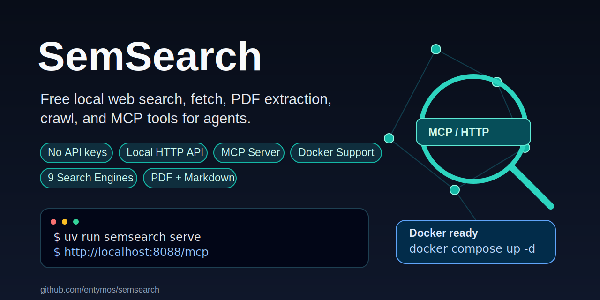
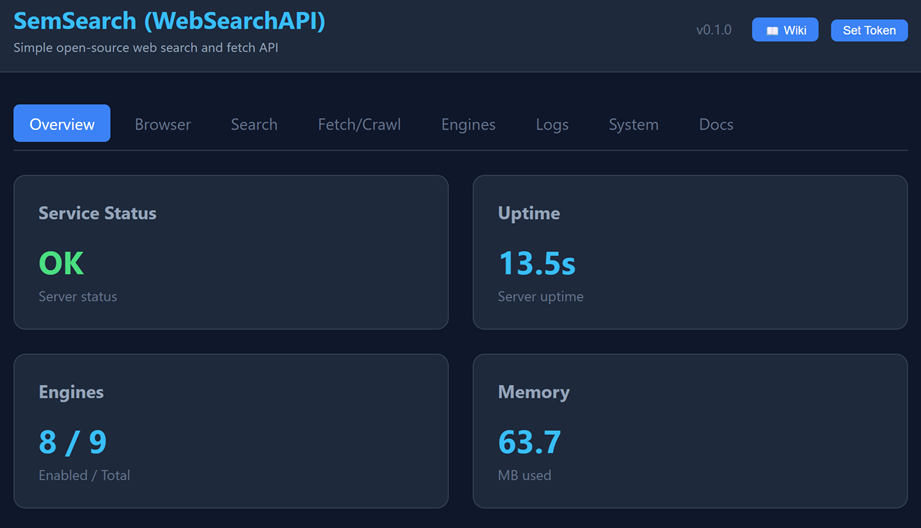

 
# SemSearch

[](https://www.python.org/)
[](LICENSE)
[](README.md#mcp)
[](.github/workflows/ci.yml)

Free local web search, fetch, PDF extraction, crawl, and MCP tools for agents.

SemSearch exposes a local HTTP API and MCP server that work with Codex, VSCode, and other MCP clients. It is designed to run without API keys, while still supporting Docker for users who prefer containers.

## Quick Start

### uv (default)
```sh
uv run semsearch serve
```

### uvx (issue: uvx tries to fetch from PyPI registry)

```sh
uvx semsearch serve
```

Then connect your MCP client to:

```text
http://localhost:8088/mcp
```

Optional dashboard:

```text
http://localhost:8088/dashboard
```


### Source Install

```sh
git clone https://github.com/entymos/semsearch.git
cd semsearch
python -m pip install -e ".[dev]"
semsearch serve
```

PowerShell uses the same installed command:

```powershell
semsearch serve --host 127.0.0.1 --port 8088
```

### Docker

```sh
docker compose up -d
curl -fsS http://localhost:8088/api/health
```

Docker binds to `127.0.0.1` by default. Expose it beyond localhost only when you intentionally want LAN access:

```sh
SEMSEARCH_BIND_HOST=0.0.0.0 docker compose up -d
```

PowerShell:

```powershell
$env:SEMSEARCH_BIND_HOST="0.0.0.0"; docker compose up -d
```

If Docker fails while pulling `python:3.12-slim` with a TLS handshake timeout, Docker Hub was not reachable from the local Docker daemon. Retry the base image pull first:

```powershell
docker pull python:3.12-slim
docker compose up -d --build
```

If you already have another compatible Python 3.12 slim image available from an internal mirror or local cache, override the base image:

```powershell
$env:SEMSEARCH_PYTHON_IMAGE="your-registry/python:3.12-slim"; docker compose up -d --build
```

## Documentation

### Technical Wiki

For comprehensive technical documentation covering all MCP tools, search engines, data processing, and architecture:

📖 **[SemSearch Technical Wiki](SEMSEARCH-wiki.md)** - Complete guide including:
- MCP Tools (Web Search, Web Fetch, Batch Fetch, Crawl, Search with Fetch)
- Result ranking algorithm
- 9 Search engine implementations
- HTML processing & format conversion
- Performance optimization
- Security considerations
- Comparison with SearXNG

### Quick References

- **[Search Engines Guide](SEMSEARCH-wiki.md)** - Engine selection, diagnostics, and practical combinations
- **[Configuration Guide](semsearch/default_config.yaml)** - Default configuration options

## CLI

```sh
semsearch serve --host 127.0.0.1 --port 8088
semsearch init-config
semsearch doctor --base-url http://localhost:8088
```

Configuration path priority:

1. `SEMSEARCH_CONFIG`
2. OS user config directory managed by `platformdirs`
3. Packaged default config template

## MCP

SemSearch exposes a Streamable HTTP MCP endpoint.

Use this URL directly in clients that support HTTP MCP:

```text
http://localhost:8088/mcp
```

The browser dashboard is available at:

```text
http://localhost:8088/dashboard
```

The dashboard includes engine toggles and live per-engine probes that report latency, result count, last error, and sample results.

Codex:

```sh
codex mcp add semsearch --url http://localhost:8088/mcp
```

VSCode:

```json
{
  "servers": {
    "semsearch": {
      "type": "http",
      "url": "http://localhost:8088/mcp"
    }
  }
}
```

Ready-to-copy MCP client examples are in [`mcp_configs/`](mcp_configs/), including Codex, VSCode, Claude Code, Cursor, Cline, Continue, Windsurf, Zed, and a generic HTTP MCP shape.

Smoke test:

```sh
curl -fsS -X POST http://localhost:8088/mcp \
  -H "Content-Type: application/json" \
  -H "Accept: application/json, text/event-stream" \
  --data '{"jsonrpc":"2.0","id":1,"method":"tools/list","params":{}}'
```

## MCP Tools

| Tool | Description |
| --- | --- |
| `web_search` | Search the web using enabled engines, with optional include/exclude domain filters |
| `web_fetch` | Fetch one URL or PDF in markdown/html/text/json/xml |
| `batch_fetch` | Fetch multiple URLs in parallel |
| `crawl` | Crawl a site with bounded depth and page count |
| `md` | Fetch a URL as markdown |
| `sem_search` | Web search with optional engine selection and top-result fetching for richer context |

`sem_search` does not use embeddings yet; it enriches web search results by fetching selected pages.
PDF URLs are extracted to text and returned in the requested output format.

## Supported Search Engines

SemSearch supports **9 free search engines** with general web, reference, academic, community, and code coverage:

| Engine | Type | Status | Notes |
| --- | --- | --- | --- |
| **DuckDuckGo** | HTML scraping | Enabled | Privacy-first general web search |
| **Qwant** | API-based | Enabled | European privacy search |
| **Startpage** | HTML scraping | Enabled | Privacy meta-search |
| **Wikipedia** | API-based | Enabled | Reference/knowledge search, multilingual |
| **arXiv** | API-based | Enabled | Academic papers and preprints |
| **Hacker News** | API-based | Enabled | Developer/community discussions via Algolia HN Search |
| **GitHub Repositories** | API-based | Enabled | Open-source repository discovery |
| **Bing** | HTML scraping | Disabled | General search, may rate-limit |
| **Google** | HTML scraping | Disabled | ToS/rate-limit risk; local testing only |

### Configuration

Edit `config/semsearch.yaml` to enable/disable engines:

```yaml
engines:
  - name: duckduckgo
    enabled: true
    timeout_sec: 8
  - name: qwant
    enabled: true
    timeout_sec: 8
  - name: startpage
    enabled: true
    timeout_sec: 8
  - name: wikipedia
    enabled: true
    timeout_sec: 8
  - name: arxiv
    enabled: true
    timeout_sec: 10
  - name: hackernews
    enabled: true
    timeout_sec: 8
  - name: github
    enabled: true
    timeout_sec: 8
  - name: bing
    enabled: false
    timeout_sec: 8
  - name: google
    enabled: false
    timeout_sec: 10
```

### Engine Selection

Use the `engines` parameter to search specific engines:

```http
GET /api/search?q=python&engines=duckduckgo,qwant
```

MCP:

```json
{
  "jsonrpc": "2.0",
  "method": "tools/call",
  "params": {
    "name": "web_search",
    "arguments": {
      "q": "machine learning",
      "engines": "duckduckgo,wikipedia"
    }
  }
}
```

### Engine Comparison

- **DuckDuckGo**: Best for general web search, no tracking
- **Qwant**: European alternative, good for non-English queries
- **Startpage**: Privacy meta-search coverage
- **Wikipedia**: Best for reference/knowledge queries
- **arXiv**: Best for papers, AI/ML, math, physics, and academic preprints
- **Hacker News**: Best for developer discussion and launch/discovery context
- **GitHub**: Best for open-source projects and repository discovery
- **Bing**: Standard search (rate-limited)
- **Google**: Most comprehensive but ToS/rate-limit risk (disabled by default)

For detailed documentation, see [SEARCH_ENGINES_GUIDE.md](SEARCH_ENGINES_GUIDE.md).
For detailed documentation, see [SEARCH_ENGINES_GUIDE.md](SEARCH_ENGINES_GUIDE.md).

## REST API

```http
GET /api/health
GET /api/search?q=query&limit=10&language=ko&time_range=week&include_domains=example.com&exclude_domains=spam.example
GET /api/fetch?url=https://example.com&format=markdown&max_chars=5000
POST /api/batch_fetch
GET /api/crawl?url=https://example.com&depth=1&max_pages=10&format=markdown
GET /api/engines
POST /api/engines/{name}/enable
POST /api/engines/{name}/disable
POST /api/engines/{name}/probe?query=weather
```

Batch fetch body:

```json
{
  "urls": ["https://example.com", "https://example.org/report.pdf"],
  "format": "markdown",
  "concurrency": 5,
  "max_chars": 5000
}
```

Admin engine endpoints require `Authorization: Bearer <SEMSEARCH_ADMIN_TOKEN>` only when that environment variable is set.

## Safety

- Search/fetch/crawl are intended for local lab use.
- Docker Compose binds to `127.0.0.1` by default through `SEMSEARCH_BIND_HOST`.
- Fetch/crawl currently use `unrestricted_lab` mode, so do not expose this service publicly without a reverse proxy, HTTPS, auth, and stricter fetch guards.
- `/mcp` rejects non-local browser `Origin` headers to reduce DNS rebinding risk.
- Engine management and config mutation can be protected with `SEMSEARCH_ADMIN_TOKEN`.

## Development

```sh
python -m pip install -e ".[dev]"
pytest
ruff check
```

The `tests/` directory is intentionally kept for CI and release smoke checks. It is not installed as runtime package code; only `semsearch*` is included in the wheel.

Docker smoke test:

```sh
docker compose up -d --build
semsearch doctor --base-url http://localhost:8088
```

## Release Targets
- Docker image suitable for GHCR or Docker Hub.

## Attribution

SemSearch is inspired by and builds upon:

- [SearXNG](https://github.com/searxng/searxng) - meta search engine architecture
- [Crawl4AI](https://github.com/unclecode/crawl4ai) - web fetch/crawl functionality

## License

AGPL-3.0. See [LICENSE](LICENSE).
